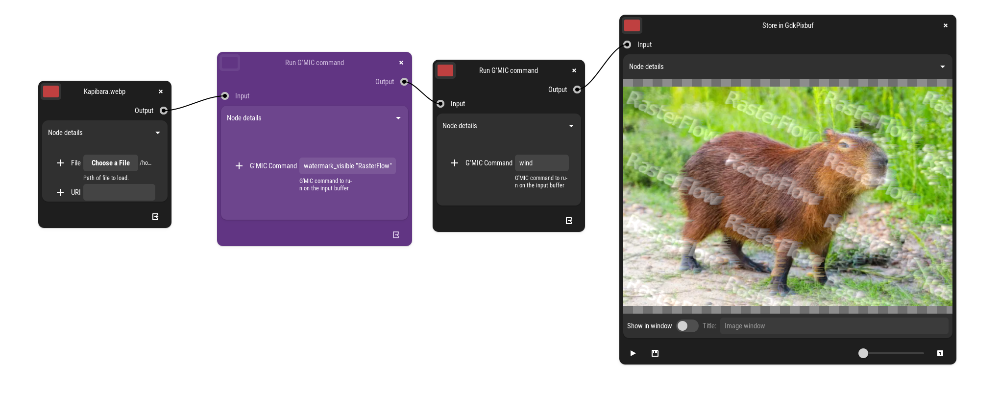

# GEGL G’MIC Operation — Experimental Integration

This project provides a **custom GEGL operation** that runs arbitrary  
**G’MIC commands** directly on GEGL buffers — with **full-image processing**,  
no tiling artifacts, and full **RGBA float** support.

Originally implemented for **RasterFlow**, but it works in **any GEGL-based pipeline**,  
including standalone `gegl` CLI or other applications embedding GEGL.

## ✨ Features

- ✔️ Execute any G’MIC pipeline on GEGL buffers  
- ✔️ No tiling artifacts (thanks to full-buffer scan + ROI stitching)  
- ✔️ Supports RGB and RGBA float  
- ✔️ Thread-safe (forced single-execution per operation)  
- ✔️ Works with synthetic generators (e.g. `sierpinski`, `plasma`, etc.)  
- ✔️ Works with transforms (`watermark`, `negate`, `fx_*`, etc.)

## 📸 Example — G’MIC + GEGL in action in RasterFlow



## 🔧 Installing

Compile and install using Meson/Ninja:

```bash
meson setup build
ninja -C build
ninja -C build install
```

## 🧪 Running from terminal (GEGL CLI)

```bash
gegl \
  -i input.png \
  -o output.png \
  -- gmic:command command="raindrops"
```

## 🛠 How it works (technical overview)

GEGL processes images in **tiles**, but **G’MIC requires full-image context**,  
especially for operations involving:

- geometry  
- FFT / spectral domain  
- global statistics  
- synthetic image creation  

This plugin solves the mismatch by:

1. Fetching the **entire input buffer** (`gegl_buffer_get()`).
2. Running the **G’MIC interpreter once** on the full image.
3. Reconstructing the output **tile-by-tile** to satisfy GEGL’s ROI requests.
4. Enforcing **non-threaded evaluation** (`operation->threaded = FALSE`).
5. Providing `get_cached_region()` and `get_required_for_output()`  
   so GEGL **always requests the full image** instead of tiles.